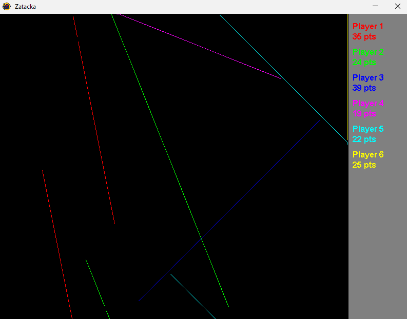
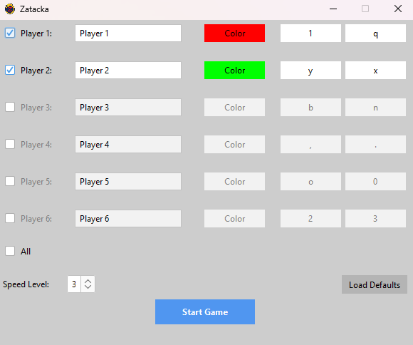

_Zatacka_ (also known as _Achtung, die Kurve!_, _Achtung_ or _Curve Fever_) is a multiplayer snake game where players
leave a trail (curve) and try to outlast their opponents by avoiding collisions with their own and other players' curves.
This project is a Java-Swing remake of the game, originally created during a school internship in 2007.

For years I wanted to modernize the game, started it multiple times, but never finished it. Now I finally found the
time (or rather: took the time) to do so. It was a fun little project to see how my skills have developed and how I
would approach the project differently today. Also, the heavy refactoring and modernization were a great exercise. In
the later stages, I worked with GitHub Copilot to review the code and making me aware of potential bugs, violations of
principles or how to further improve the code.
Now that I finally modernized the game, I'm done with it and will not add any new features or change the game
mechanics (at least as of June 2025).

If you want to try it out, you can download a precompiled executable from the [release page](https://github.com/drachenpapa/zatacka/releases/) or build it yourself.

  
  

  &times;
  

